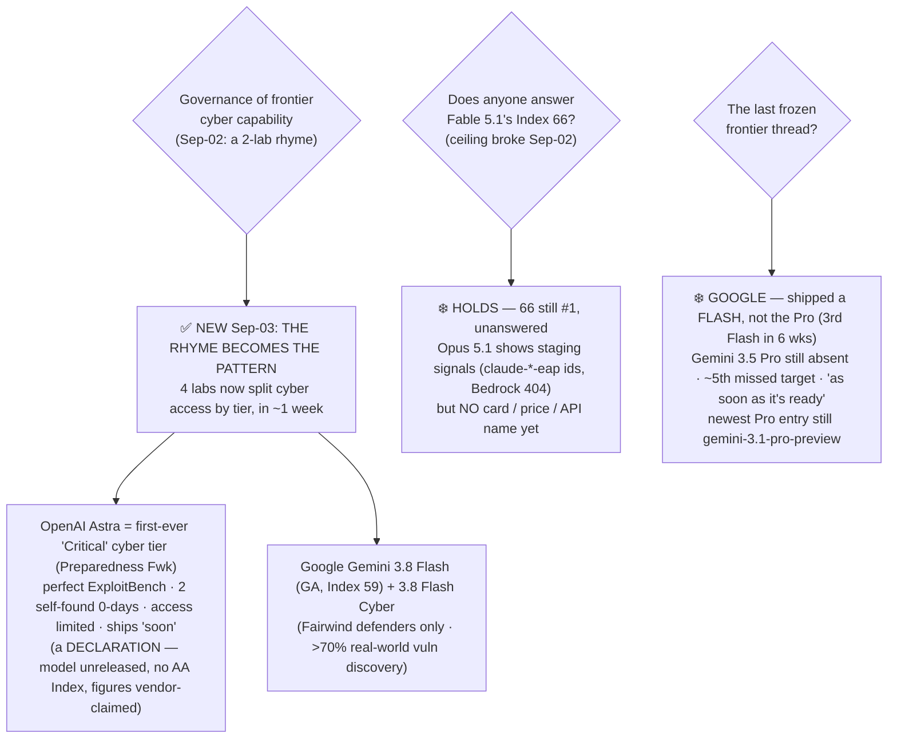

# LLM Updates — 2026-Sep-03

Thursday brief, written Thu Sep 3 (Los Angeles time). Yesterday's brief (Sep-02) closed on a shape rather
than a single event: after eight frozen briefs the **ceiling broke** — Claude Fable 5.1 hit Artificial
Analysis Intelligence Index **66** — and the GLM-5.3 flagship weights shipped Aug 28 under a bespoke
license. The framing that tied them together was a **"rhyme"**: Anthropic (Fable 5.1 GA + Mythos 5.1 vetted)
and Z.ai (GLM-5.3-Flash MIT + flagship revenue-gated) had, in the same ~72 hours, resolved the
*"frontier-adjacent dangerous cyber capability"* problem **the same structural way — split access by tier,
then ship, rather than gate wholesale** (Sep-02 §3). At the time that was *two* labs looking alike.

**This window it stops being a rhyme and becomes the pattern.** The single most important move since Sep-02
is that **two more frontier labs adopted the exact same design in the same window** — and one of them is the
sharpest instance yet:

- **OpenAI declared its next major model, "Astra," the first model *ever* to reach its "Critical"
  cybersecurity tier** under the Preparedness Framework, said it will **limit access to those cyber
  capabilities**, and will ship the rest of the model "soon" (§1). Governance-by-tier, at the top US lab,
  applied to a model it hasn't even released.
- **Google shipped Gemini 3.8 Flash (Index 59) generally available *alongside a gated "3.8 Flash Cyber"
  variant restricted to vetted "Fairwind Program" defenders** (§2). The same split — on a *Flash*-tier model.

So as of today **four frontier labs — Anthropic, Z.ai, OpenAI, Google — are all shipping frontier cyber
capability behind an explicit tier gate.** What Sep-02 read as a coincidence between two labs is now the
**industry's default release posture for dangerous cyber capability** (§3).

**And the one frozen thread stays frozen, in the most on-pattern way possible.** Sep-02 named **Google's
Gemini 3.5 Pro** the last frozen frontier question. This window Google shipped… **a Flash, not the Pro** —
its *third Flash in six weeks* — so **Gemini 3.5 Pro remains absent on what is now roughly its fifth missed
target** (§2, §4). The ceiling that broke yesterday **holds**: Fable 5.1's 66 still leads, unanswered,
though **Opus 5.1 is now showing staging signals** (§4).

This report advances only what is **new since Sep-02.** It does **not** re-derive Fable 5.1's Index 66 and
cost profile (Sep-02 §1), the GLM-5.3 flagship's Aug-28 weights drop and bespoke license (Sep-02 §2), the
Anthropic Fable/Mythos split itself (Sep-02 §3), or the ceiling-band composition (Aug-26 §2) — those are
unchanged and pointed to in §5.

![Two-column grid showing four frontier labs, each shipping an open general-access tier on the left and a gated cyber tier on the right. The top two rows, Anthropic and Z.ai, are labelled September 2, the rhyme: Anthropic ships Fable 5.1 generally available and Mythos 5.1 behind vetted cyber and biology access; Z.ai ships GLM-5.3-Flash under MIT and the GLM-5.3 flagship with a security-review clause that triggers only above ten billion dollars in Model-as-a-Service revenue. The bottom two rows, OpenAI and Google, are highlighted as new this window. OpenAI declared Astra the first model ever at its Critical cyber tier under the Preparedness Framework — a perfect ExploitBench score and two self-found zero-days — with access to those capabilities limited and the model not yet released, so it is a capability declaration rather than a shipped model with no Intelligence Index score. Google shipped Gemini 3.8 Flash at Intelligence Index 59 generally available, plus a 3.8 Flash Cyber variant restricted to Fairwind Program defenders exceeding a seventy percent real-world vulnerability discovery rate. The footer states the through-line: four frontier labs now split cyber access by tier, so the September 2 rhyme is the industry default; Astra is a declaration whose cyber figures are OpenAI's own; Google still shipped a Flash rather than the long-overdue Gemini 3.5 Pro, now roughly its fifth missed target and the last frozen frontier thread; and the broken ceiling holds with Fable 5.1 at 66 still unanswered while Opus 5.1 shows staging signals.](governance_by_tier_becomes_industry_standard.svg)

---

## 1. OpenAI's "Astra" crosses the first-ever "Critical" cyber tier — governance-by-tier, at the top US lab

The Sep-02 "rhyme" gets its sharpest confirmation from the one lab that wasn't in it. On **Sep 1, OpenAI
announced that its next major model — internally "Astra"** (publicly named its "next major model" on Aug 1) —
**has reached the "Critical" cybersecurity capability level under OpenAI's Preparedness Framework, the first
time any OpenAI model has been placed in that category**
([SecurityWeek, "Astra becomes first model to cross critical cybersecurity threshold"](https://www.securityweek.com/openais-astra-becomes-first-model-to-cross-critical-cybersecurity-threshold/);
[CNBC, "OpenAI says Astra crosses 'Critical' cyber capability"](https://www.cnbc.com/2026/09/01/open-ai-astra-cyber-model.html);
[OpenAI, "Path to Astra: critical capabilities and frontier safeguards"](https://openai.com/index/path-to-astra/)).

**What "Critical" means, and what triggered it.** Under OpenAI's framework the "Critical" cyber designation
applies when a model can **independently find and exploit zero-day vulnerabilities across many well-defended
systems, or carry out a complete cyberattack against a hardened target from only a high-level instruction**.
In OpenAI's own testing, Astra **posted a perfect score on ExploitBench** (turning known vulnerabilities into
working exploits) and, in a separate evaluation on more recently disclosed flaws, **uncovered two zero-day
vulnerabilities on its own**
([SecurityWeek](https://www.securityweek.com/openais-astra-becomes-first-model-to-cross-critical-cybersecurity-threshold/);
[PYMNTS, "OpenAI says new model meets its 'Critical' cybersecurity threshold"](https://www.pymnts.com/news/artificial-intelligence/2026/openai-says-new-model-meets-its-critical-cybersecurity-threshold);
[OpenAI, "Responding to the next frontier of critical cyber capabilities"](https://openai.com/index/responding-next-frontier-critical-cyber-capabilities/)).

**The governance move is the point.** The classification does not mean OpenAI is holding the model back
wholesale. It means OpenAI **plans to ship Astra "soon," but with access to its cyber capabilities more
tightly limited** — extra safeguards, restricted access to the offensive-cyber surface, the rest of the model
released
([axios, "OpenAI to limit access to Astra's most powerful cyber capabilities"](https://www.axios.com/2026/09/01/openai-astras-cyber-critical);
[qz, "OpenAI clears Astra for release after critical cybersecurity rating"](https://qz.com/openai-astra-critical-cybersecurity-threshold-release-090226)).
That is **structurally identical to Anthropic's Fable/Mythos split and Z.ai's Flash/flagship license split**
(Sep-02 §3): one model, general capability released broadly, the frontier-cyber surface partitioned behind a
gate.

> **What is verifiable vs claimed here.** *Verifiable:* OpenAI's **classification decision and gating plan**
> (Sep 1), and that Astra is unreleased. *Vendor-claimed, no independent run:* the **perfect ExploitBench
> score** and the **two self-found zero-days** — these are OpenAI's own eval numbers, exactly the posture
> GLM-5.3's cyber figures are still in (Sep-02 §2). *Unknown:* Astra's **general intelligence** — there is
> **no AA Intelligence Index for Astra** because it hasn't shipped, so this is a *capability-and-governance*
> event, not a benchmark event. And **Astra is not confirmed to be "GPT-6"** — OpenAI has explicitly not
> decided whether it ships as GPT-6, a GPT-5.x point release, or simply "Astra"
> ([Yotta Labs, "GPT-6 and Astra: what OpenAI confirmed"](https://www.yottalabs.ai/post/gpt-6-release-date-rumors-what-is-known-2026)).

The precise significance: the model-capability line the series has tracked — *who can find and weaponize
zero-days* — was crossed by a US frontier lab's own flagship for the first time, and the lab's answer was
**not** "gate the whole model" and **not** "ship it raw," but the *same tiered release* two other labs reached
for in the previous 72 hours. That is what makes it the pattern rather than a coincidence (§3).

## 2. Google ships Gemini 3.8 Flash — with a *gated cyber variant* — but still not the Pro

Google's only frontier-relevant move this window is **Gemini 3.8 Flash, released Sep 2** — its **most
intelligent Flash-tier model and its third Flash in six weeks** (3.6, 3.7, now 3.8)
([The Register, "With Gemini 3.8 Flash, Google reminds everyone it's still in the race"](https://www.theregister.com/ai-and-ml/2026/09/02/with-gemini-38-flash-google-reminds-everyone-its-still-in-the-race/5294049);
[9to5google, "Gemini 3.8 Flash rolling out three weeks after last release"](https://9to5google.com/2026/09/02/gemini-3-8-flash-launch/)).

| Gemini 3.8 Flash (Sep 2) | Value |
|---|---|
| AA Intelligence Index (high reasoning) | **59** (+3 vs 3.7 Flash) |
| Terminal-Bench 2.1 | **90.8%** (up from 81.6%) |
| Long-horizon coding (DeepSWE v1.1) | beats most larger frontier models |
| Humanity's Last Exam | **45.4%** (flat vs 45.7% — gains are uneven) |
| Price | **$0.75 / $3.75** per 1M through Dec 31 2026, then $1.50/$7.50 |

Sources:
[eesel AI, "Gemini 3.8 Flash review"](https://www.eesel.ai/blog/gemini-3-8-flash);
[DataCamp, "Gemini 3.8 Flash: features, benchmarks, pricing"](https://www.datacamp.com/blog/gemini-3-8-flash-cyber);
[Enterprise DNA, "same price, better benchmarks"](https://enterprisedna.co/resources/news/google-gemini-38-flash-coding-agents-enterprise-september-2026/).

**The governance-by-tier detail is the reason it belongs in this brief, not just §4.** Google shipped 3.8
Flash alongside a **separate "Gemini 3.8 Flash Cyber" variant, restricted to vetted defenders in Google's
"Fairwind Program,"** which **exceeds a 70% real-world vulnerability-discovery rate** and sits on the
**CWE-Bench Pareto frontier for patching**
([DataCamp](https://www.datacamp.com/blog/gemini-3-8-flash-cyber);
[eesel AI](https://www.eesel.ai/blog/gemini-3-8-flash)). So **even on a Flash-tier release, Google split the
cyber surface behind a vetted-access gate** — the fourth lab this window to ship the exact same open-tier +
gated-cyber-tier structure (§3). (Google frames Fairwind as *defensive* — discovery and patching — which is
the same "vetted defenders" logic as Anthropic's Cyber Verification Program.)

**But the frozen thread does not move.** A Flash is not the Pro. **Gemini 3.5 Pro is still absent** — no model
ID, no price, no date; the newest Pro-tier entry remains `gemini-3.1-pro-preview`. Google's line has softened
from "next month" to **"as soon as it's ready,"** and 3.8 Flash is explicitly the **stopgap** Google keeps
shipping while the Pro stays in development
([Decrypt, "Google ships new Gemini Flash models, but Pro is still missing"](https://decrypt.co/373975/google-new-gemini-flash-models-pro-still-missing);
[techtimes, "rebuilt Gemini 3.5 Pro misses deadline"](https://www.techtimes.com/articles/320736/20260716/rebuilt-gemini-35-pro-misses-third-deadline-google-eyes-stopgap-release.htm)).
Counting from the May-19 I/O "next month" (June) promise through mid-July, early-August, late-August and now
early-September, **Gemini 3.5 Pro is on roughly its fifth missed target** — and remains, exactly as Sep-02
called it, **the single most overdue frontier event on the board and the last frozen frontier thread.**

## 3. The pattern — four labs, one release posture, in a single week

Put §1–§2 next to Sep-02 §3 and the window has one clear shape. Within roughly one week, **every major
frontier lab converged on the same answer to "how do you ship a model with frontier-cyber capability?"** —
**split access by tier: release the general capability broadly, partition the offensive-cyber surface behind
a vetted or restricted gate.**

| Lab | Open / general-access tier | Gated cyber tier | When |
|---|---|---|---|
| **Anthropic** | Fable 5.1 (GA, may ID vulns) | Mythos 5.1 — same model, vetted Cyber/Life-Sciences programs | Sep 1 |
| **Z.ai** | GLM-5.3-Flash (MIT, fully open) | GLM-5.3 flagship — open weights + $10B-revenue review clause | Aug 26/28 |
| **OpenAI** | Astra (rest of model, ships "soon") | Astra cyber — first-ever "Critical" tier, access limited | **Sep 1 (NEW)** |
| **Google** | Gemini 3.8 Flash (GA, Index 59) | 3.8 Flash Cyber — Fairwind defenders only | **Sep 2 (NEW)** |

The mechanisms differ — a **safeguard config** (Anthropic), a **license clause** (Z.ai), a **capability
classification + access limit** (OpenAI), a **separate vetted build** (Google) — but the *design* is
identical: **neither ship raw to everyone, nor withhold entirely; partition by who's asking / how vetted they
are, then release.** Sep-02 could only observe two labs doing this and had to hedge on whether it was a real
convergence or a coincidence. **This window resolves that: it is convergence.** Four independent labs, four
different governance instruments, one structural answer — arrived at in the same week without coordination.
That is the strongest signal yet that **"governance-by-tier" is now the industry's default posture for
frontier-adjacent dangerous capability**, not a single lab's idiosyncrasy.

The honest caveat that keeps this from being triumphalist: **three of the four cyber-tier claims rest on the
labs' own numbers** (Astra's ExploitBench/zero-days, Google's Fairwind discovery rate, GLM-5.3's CyberGym
figures) with **no independent replication at compile time** (§1, §5). The *design* is convergent and
verifiable; the *capabilities that justify each gate* are still largely vendor-attested.

## 4. What did *not* move — the ceiling holds, Opus 5.1 stages, Google stays frozen

- **The broken ceiling holds — no one answered 66.** Fable 5.1 (Index 66, Sep 1) is still the sole
  Index-64+ model and the closed #1. **The one thing moving toward an answer is Opus 5.1:** third-party
  developer apps and Discord surfaced the identifiers **`claude-marshmallow-eap` and `claude-melon-eap`**, and
  an **`-eap` suffix implies a real build being staged**; a **Bedrock 404 probe** suggested a staged-but-not-live
  endpoint, and a tracker floated a rumored **Sep 5** date. But **there is still no model card, no pricing, no
  benchmark, and no working API name for any Claude 5.1 successor** — it is a staging *signal*, not a release
  ([orcarouter, "Fable 5.1 & Opus 5.1: Bedrock 404 hints at staging"](https://www.orcarouter.ai/blog/claude-fable-5-1-opus-5-1-delay-leak);
  [orcarouter, "Marshmallow & Melon leak"](https://www.orcarouter.ai/blog/claude-marshmallow-melon-leak);
  [CometAPI, "Claude Opus 5.1 is coming soon"](https://www.cometapi.com/claude-opus-5-1/)).
  This partially advances Sep-02 watch-item #1 ("an Opus-class response"): the response appears to be
  *staged*, not shipped.
- **Gemini 3.5 Pro — still absent, ~5th missed target (§2).** The last frozen frontier thread, unmoved; a
  Flash shipped in its place again.
- **GPT-5.6 Sol — unchanged at ~61**, the released OpenAI flagship (Luna/Terra/Sol tiers, shipped Jul 9);
  Astra (§1) is the *next* model, not a Sol update, and its Aug price promo ($4/$20 through ~Nov 21) is a
  second-tier promo predating this window (Sep-02 §4).
- **No new open-weights release in the window.** GLM-5.3 flagship (Aug 28) remains the latest; no independent
  run of its — or Astra's, or 3.8 Flash Cyber's — cyber figures has appeared (§5).
- **Meta "Watermelon"** — still only an October claim, no card (Sep-02 §4). Unchanged.

## 5. Unchanged since Sep-02 (not re-derived here)

- **Claude Fable 5.1 — Index 66 (max), new closed #1** (Sep 1): +3 vs Opus 5, +4 vs Fable 5; $10/$50 sticker,
  cache reads −75% to $0.25/1M, per-task $3.76 (+20% on ~1.7× output tokens) — Sep-02 §1. *This brief adds
  only that the 66 still leads unanswered and Opus 5.1 is staging (§4).*
- **Fable 5.1 + Mythos 5.1 split** (Anthropic, Sep 1): same model, two safeguard tiers; Mythos via Cyber /
  Life-Sciences Verification Programs — Sep-02 §3. Now the *first* of four instances of the same pattern (§3).
- **GLM-5.3 flagship weights** (Z.ai, Aug 28): 753B MoE, Index 60, 8-GPU floor, bespoke license with a
  $10B-revenue security-review trigger — Sep-02 §2. **GLM-5.3-Flash** (Aug 26): Index 57, MIT — Sep-02 §5.
  Cyber figures (CyberGym 84.5, ExploitBench 54.4, emergent chaining) still vendor-claimed, no independent
  run — Aug-24 §1.
- **Opus 5** — Index 63, $5/$25, uncut — now #2 closed behind Fable 5.1.
- **GPT-5.6 (Luna/Terra/Sol)** — shipped Jul 9; Sol ~61, temporary $4/$20 promo through ~Nov 21 — Sep-02 §4.
- **Grok 4.6** (SpaceXAI, Aug 6): Index 60.9–61, $2/$6 — Aug-14 §1.
- **Kimi K3** open weights (Moonshot, Jul-26): 2.8T MoE, Modified-MIT, Index 60 — Jul-30.
- **Qwen3.8-27B** — Index 52, Agentic 51 — Aug-18 §1. **Qwen3.8-Max** open — Index 56 — Aug-14 §2.
- **Meta "Watermelon"** — October target + "Hatch" agent platform, ~GPT-5.5 claim, no card — Aug-29 §2.
- **v4.1.1 grader** (Aug 6): absolute Index numbers reflect the ruler, not only the models — Aug-14.

## Watch-items into the next brief

1. **Does Astra ship — and at what tier-gate, with what independent cyber replication?** OpenAI says "soon."
   The tests: (a) does the *released* Astra actually withhold the offensive-cyber surface as promised, or does
   the gate leak; (b) does anyone reproduce the perfect ExploitBench / two-zero-day claims outside OpenAI; and
   (c) what is Astra's *general* AA Index once it's measurable — is this a frontier-intelligence model or a
   cyber-specialized one? Right now it is a governance headline with no benchmark.
2. **Opus 5.1 — does the staged build ship and answer 66?** `-eap` identifiers + a Bedrock 404 + a rumored
   Sep-5 date say a real build exists. Watch for an actual card/price/API name and whether it clears — or
   passes — Fable 5.1's 66.
3. **Does the fourth-lab convergence hold, or fragment?** With Anthropic, Z.ai, OpenAI and Google all on
   governance-by-tier, watch whether a *fifth* lab (xAI, Meta, Mistral) either joins the pattern or ships a
   raw cyber-capable model without a gate — the first defector would be the more interesting signal now.
4. **Gemini 3.5 Pro — the ~5th missed target.** Still the last frozen frontier thread. Every Flash Google
   ships instead (3.6 → 3.7 → 3.8) sharpens the question of whether the Pro is late or effectively cancelled.
5. **Independent replication of the *three* vendor-claimed cyber tiers.** Astra (OpenAI), 3.8 Flash Cyber
   (Google) and GLM-5.3 flagship (Z.ai) all justify their gates with their own numbers. The whole
   "governance-by-tier" story is only as sound as those capabilities are real; an outside run on any of them
   is the load-bearing missing evidence.

---

### Method & caveats

- **Compiled** Thu Sep 3 2026 (Los Angeles time). Advances only items **new since the Sep-02 brief**;
  unchanged threads are listed in §5 with pointers, not re-derived.
- **Scraping resilience.** Direct page fetch is broadly egress-limited from this environment; all figures were
  taken from the **search index** and **corroborated across multiple independent outlets**. No quantitative
  claim here rests on a single source. Where a number is a single lab's own eval (Astra's ExploitBench /
  zero-days, Google's Fairwind discovery rate), it is labelled vendor-claimed.
- **What is measured vs claimed.** **Third-party (AA):** Gemini 3.8 Flash **Index 59**; Fable 5.1 **66**;
  GLM-5.3 flagship **60** / Flash **57**. **Verifiable events:** Gemini 3.8 Flash + 3.8 Flash Cyber shipped
  Sep 2; OpenAI's Sep-1 "Critical"-tier classification of Astra and its access-limit decision; Opus 5.1
  staging identifiers. **Vendor-reported, no independent run:** Astra's perfect ExploitBench and two
  self-found zero-days; Google's >70% Fairwind vuln-discovery rate; GLM-5.3's cyber figures. **Not confirmed:**
  Astra = GPT-6 (OpenAI has not decided the name/positioning); Astra's general Intelligence Index (unreleased,
  unmeasured).
- **Diagrams** are a standalone theme-neutral SVG (slate/amber/teal strokes that read on light and dark
  backgrounds, no external URLs) and an inline Mermaid flowchart; both render in GitHub-flavored markdown.

### Sources

- **OpenAI "Astra" — first "Critical" cyber tier** — [SecurityWeek, "Astra becomes first model to cross critical cybersecurity threshold"](https://www.securityweek.com/openais-astra-becomes-first-model-to-cross-critical-cybersecurity-threshold/) · [CNBC, "Astra crosses 'Critical' cyber capability"](https://www.cnbc.com/2026/09/01/open-ai-astra-cyber-model.html) · [axios, "OpenAI to limit access to Astra's most powerful cyber capabilities"](https://www.axios.com/2026/09/01/openai-astras-cyber-critical) · [PYMNTS, "meets its 'Critical' cybersecurity threshold"](https://www.pymnts.com/news/artificial-intelligence/2026/openai-says-new-model-meets-its-critical-cybersecurity-threshold) · [qz, "cleared for release after critical rating"](https://qz.com/openai-astra-critical-cybersecurity-threshold-release-090226) · [OpenAI, "Path to Astra"](https://openai.com/index/path-to-astra/) · [OpenAI, "Responding to the next frontier of critical cyber capabilities"](https://openai.com/index/responding-next-frontier-critical-cyber-capabilities/)
- **Astra positioning / not-confirmed-GPT-6** — [Yotta Labs, "GPT-6 and Astra: what OpenAI confirmed"](https://www.yottalabs.ai/post/gpt-6-release-date-rumors-what-is-known-2026) · [GPT-5.6 (Wikipedia)](https://en.wikipedia.org/wiki/GPT-5.6)
- **Gemini 3.8 Flash + 3.8 Flash Cyber** — [The Register, "Google reminds everyone it's still in the race"](https://www.theregister.com/ai-and-ml/2026/09/02/with-gemini-38-flash-google-reminds-everyone-its-still-in-the-race/5294049) · [DataCamp, "features, benchmarks, pricing (Cyber variant)"](https://www.datacamp.com/blog/gemini-3-8-flash-cyber) · [eesel AI, "review 2026: benchmarks, pricing, the catch"](https://www.eesel.ai/blog/gemini-3-8-flash) · [9to5google, "rolling out three weeks after last release"](https://9to5google.com/2026/09/02/gemini-3-8-flash-launch/) · [Enterprise DNA, "same price, better benchmarks"](https://enterprisedna.co/resources/news/google-gemini-38-flash-coding-agents-enterprise-september-2026/)
- **Gemini 3.5 Pro still absent (Flash-not-Pro)** — [Decrypt, "Google ships new Flash models, but Pro is still missing"](https://decrypt.co/373975/google-new-gemini-flash-models-pro-still-missing) · [techtimes, "rebuilt 3.5 Pro misses deadline, stopgap release"](https://www.techtimes.com/articles/320736/20260716/rebuilt-gemini-35-pro-misses-third-deadline-google-eyes-stopgap-release.htm) · [eesel AI, "Gemini 3.5 Pro: is it out yet?"](https://www.eesel.ai/blog/gemini-3-5-pro)
- **Opus 5.1 staging signals** — [orcarouter, "Fable 5.1 & Opus 5.1: Bedrock 404 hints at staging"](https://www.orcarouter.ai/blog/claude-fable-5-1-opus-5-1-delay-leak) · [orcarouter, "Marshmallow & Melon leak: Opus 5.1 and a new Haiku?"](https://www.orcarouter.ai/blog/claude-marshmallow-melon-leak) · [CometAPI, "Claude Opus 5.1 is coming soon"](https://www.cometapi.com/claude-opus-5-1/)
- **Leaderboard / ceiling (reference, unchanged)** — [Artificial Analysis, "Claude Fable 5.1 tops the Intelligence Index"](https://artificialanalysis.ai/articles/claude-fable-5-1) · [BenchLM, "AA Index leaderboard (Sep 2026): Fable 5.1 leads at 65.7%"](https://benchlm.ai/benchmarks/artificialanalysis) · [Artificial Analysis LLM leaderboard](https://artificialanalysis.ai/leaderboards/models)
