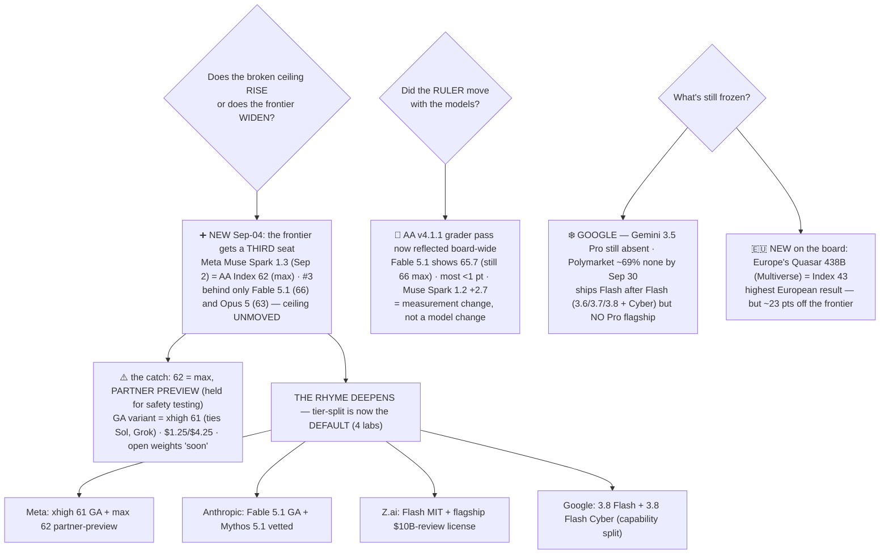

# LLM Updates — 2026-Sep-04

Friday brief, written Fri Sep 4 (Los Angeles time). Two days ago (Sep-02) this series recorded the
frozen frontier finally breaking: after eight briefs of no Index-64 model, **Claude Fable 5.1** shipped
at **AA Intelligence Index 66** and took a clean new #1, and the through-line was **governance-by-tier** —
Anthropic paired Fable 5.1 (GA) with Mythos 5.1 (vetted-access, same model), and Z.ai shipped the GLM-5.3
flagship weights open under a bespoke license whose only real constraint fires for Model-as-a-Service
operators above $10B revenue. The one thread left frozen was Google.

**This window the ceiling does not rise — it gains a neighbor, and the neighbor arrives wearing the exact
same tier-split.** On **Sep 2 Meta shipped Muse Spark 1.3** and, on Artificial Analysis's own framing,
**"reached the frontier"**: its **max** variant scores **Index 62 — third overall, behind only Fable 5.1
and Opus 5** — but that 62 is a **limited preview for Meta's partners, held back until additional safety
testing completes**, while the **generally available** `xhigh` variant scores **61** and ties GPT-5.6 Sol
and Grok 4.6 (§1). That is the third instance in 72 hours of the design Sep-02 named — *ship the strong
config behind a gate, release a slightly weaker tier openly* — and Google's own Flash line (3.8 Flash + a
**3.8 Flash Cyber** variant, §4) makes an arguable fourth. **The tier-split has become the industry
default** (§3).

**Two smaller moves round out the window.** The *ruler* settled: AA's **v4.1.1 grader pass** (upgraded
grader models + latest τ³-Banking) is now reflected across the board — Fable 5.1 shows **65.7** on the
leaderboard (still **66** at max), most models moved **<1 point**, and the largest single change was
**Muse Spark 1.2 (xhigh) +2.7** — a measurement change, not a model change (§2). And **Europe put its
first model on the board**: **Quasar 438B** from Multiverse Computing (Sep 2), the **highest-scoring
European model at Index 43** — a sovereign-AI milestone, but ~23 points off the frontier (§4).

**What stayed frozen is still just Google.** Gemini 3.5 Pro remains absent — Polymarket now puts **69% on
no Gemini Pro before Sep 30** — even as Google ships Flash after Flash (§4). With the ceiling broken *and*
a third lab now at the frontier, **Google is the one empty flagship tier on the board.**

This report advances only what is **new since Sep-02.** It does **not** re-derive Fable 5.1's Index 66 and
cost profile (Sep-02 §1), the Fable/Mythos split (Sep-02 §3), the GLM-5.3 flagship weights + bespoke
license (Sep-02 §2), or the composition of the ceiling band — those are unchanged and pointed to in §5.

![Horizontal bar chart of the Artificial Analysis Intelligence Index two days after the ceiling broke. Claude Fable 5.1 still leads at 66 at max effort (65.7 on the settled leaderboard after the v4.1.1 grader pass), over Claude Opus 5 at 63. New this window, Meta's Muse Spark 1.3 takes the third seat: its max variant scores 62 but is in limited preview for Meta's partners only, held back until additional safety testing completes, while the generally available xhigh variant scores 61 and ties GPT-5.6 Sol and Grok 4.6. Beneath the frontier band sit the top open-weights models, GLM-5.3 flagship and Kimi K3 at 60. A callout notes that Muse Spark 1.3's best result comes from a model developers cannot broadly use yet, priced at one dollar twenty-five per million input and four dollars twenty-five per million output on the available tier, with a cheaper contributor tier that trains on your traffic, plus open weights and a model codenamed Watermelon promised soon. A footer states the through-line: the tier-split is now the industry default — Anthropic, Z.ai, Meta and even Google's Flash line all ship their strongest or riskiest configuration behind a gate while releasing a slightly weaker tier openly, and Google remains the one empty flagship tier with no Gemini 3.5 Pro while Europe puts its first model on the board with Quasar 438B at 43.](frontier_gains_third_seat_tier_split_default.svg)

---

## 1. Meta reaches the frontier's third seat — Muse Spark 1.3 at 62, but the 62 is preview-only

Sep-02 §4 filed Meta under "a claim, not a move": its next flagship carried only an October target and no
card. **That changed on Sep 2.** Meta released **Muse Spark 1.3** — Mark Zuckerberg's announcement called
it the family's biggest leap yet for coding and agentic work — and Artificial Analysis measured it into the
**third seat of the frontier**, its headline framing literally *"Meta reaches the frontier"*
([Artificial Analysis, "Muse Spark 1.3: Meta reaches the frontier"](https://artificialanalysis.ai/articles/muse-spark-1-3);
[Artificial Analysis on X](https://x.com/ArtificialAnlys/status/2095247787277553929);
[SiliconANGLE, "Meta says it has caught up with Anthropic and OpenAI"](https://siliconangle.com/2026/09/02/meta-says-it-has-caught-up-with-anthropic-and-openai-after-releasing-muse-spark-1-3-its-most-powerful-llm-so-far/)).
It is Meta's **fourth Muse Spark release in five months**.

**Where it lands — and the catch that defines it.**

| Model / variant (effort) | AA Index (v4.1.1) | Availability |
|---|---|---|
| Claude Fable 5.1 (max) | 66 | GA (§5) |
| Claude Opus 5 (max) | 63 | GA |
| **Muse Spark 1.3 (max)** | **62** | **Limited preview — Meta partners only** |
| **Muse Spark 1.3 (xhigh)** | **61** | **Generally available (API + Muse Code CLI)** |
| GPT-5.6 Sol (max) / Grok 4.6 (high) | 61 / 61 | GA |

So the honest headline is **split from the honest availability**: the number that puts Meta third — **62** —
comes from the `max` variant, which is **in limited preview for partners and held until additional safety
testing completes**; what any developer can call today is the `xhigh` variant at **61**, tied with Sol and
Grok. VentureBeat's framing is exact — *"Meta says Muse Spark 1.3 has frontier performance, but its best
results come from a model developers can't broadly use yet"*
([VentureBeat](https://venturebeat.com/technology/meta-says-muse-spark-1-3-has-frontier-performance-but-its-best-results-come-from-a-model-developers-cant-broadly-use-yet);
[fello AI, "Muse Spark 1.3: benchmarks, pricing and the catch"](https://felloai.com/muse-spark-1-3/)).

**The gains are real and concentrated in agentic/scientific work — not a knowledge spike.** Against Muse
Spark 1.2, the `xhigh` variant posts **τ³-Banking 35% → 47% (+12)**, **Terminal-Bench v2.1 80% → 85% (+5)**,
a new **GDPval-AA v2 Elo of 1709 (from 1.2's 1615, +94)**, **long-horizon coding 75.4%**, and near-ceiling
**long-context retrieval (98.5 / 98.1)** — while using **~20% fewer tool calls and ~25% fewer tokens** than
its predecessor, the efficiency direction most of the field has been moving *against*
([Artificial Analysis on X](https://x.com/ArtificialAnlys/status/2095247787277553929);
[DataCamp, "Muse Spark 1.3: features, benchmarks, pricing"](https://www.datacamp.com/blog/muse-spark-1-3);
[winbuzzer, "for longer tool-based work"](https://winbuzzer.com/2026/09/04/meta-releases-muse-spark-1-3-model-longer-tool-based-work-xcxwbn/)).

**The price is the aggressive part.** The available `xhigh` endpoint runs **$1.25 / $4.25 per 1M
input/output** — roughly an **eighth of Fable 5.1's $10/$50** input rate for a model one Index point below
Sol — at **~179 tokens/sec** with a **1M-token context**. Meta also offers a **"contributor" endpoint at
~$0.10 / $0.20 per 1M (10–20× cheaper)** in exchange for **letting Meta train on your traffic** — an
explicit data-for-price trade. Parameter count is undisclosed (Muse Spark 1.3 is proprietary today)
([eesel AI, "Muse Spark 1.3: benchmarks, pricing, what changed"](https://www.eesel.ai/blog/muse-spark-1-3);
[llm-stats, "Muse Spark 1.3 pricing & context"](https://llm-stats.com/models/muse-spark-1.3);
[coursiv, "the price of cheap tokens"](https://coursiv.io/blog/muse-spark-1-3)).

**Not yet open — but promised.** Muse Spark 1.3 ships **API-only** today; Meta says an **open-weights
version** and a **new model codenamed "Watermelon"** are on the way "soon"
([The Register, "Zuck's Muse to Spark joy with open weights release 'soon'"](https://www.theregister.com/ai-and-ml/2026/09/02/zucks-muse-to-spark-joy-with-open-weights-release-soon/5294093);
[trendingtopics, "Meta is back at the top, and the best open-weight model could follow"](https://www.trendingtopics.eu/meta-muse-spark-13/)).
This resolves Sep-02's "Watermelon = October claim" cleanly: **Watermelon is still ahead of the board;
what actually shipped is Muse Spark 1.3, a *frontier-adjacent* model reached first through a partner
gate.**

## 2. The ruler settled, not the models — AA's v4.1.1 grader pass reflected across the board

Alongside the releases, the **measurement** moved a hair. Artificial Analysis's **v4.1.1** patch — which
**upgrades the grader models and brings the latest τ³-Banking (v1.0.1)** — is now reflected across the full
leaderboard, and the net effect is small
([Artificial Analysis, "Launching v4.1.1 of the Intelligence Index"](https://artificialanalysis.ai/articles/artificial-analysis-intelligence-index-v4-1-1);
[Artificial Analysis Intelligence Index v4.1.1](https://artificialanalysis.ai/evaluations/artificial-analysis-intelligence-index)):

- **HLE, AA-LCR and AA-Omniscience are now graded by GPT-5.6 Luna (medium)**, replacing GPT-4o, Qwen3-235B-A22B-2507 and Gemini 3 Flash Preview respectively; the **τ³-Banking grader pipeline** was fixed to score trajectories that recover from unhappy paths correctly.
- **Most models moved <1 point.** The **largest single change was Muse Spark 1.2 (xhigh) at +2.7** — the outgoing Meta model, not the new one.
- On the settled board, **Claude Fable 5.1 now shows 65.7** (it remains **66 at max effort, 65 at xhigh**); **Opus 5 63**, **Muse Spark 1.3 62/61**, the field beneath unchanged. 192 models are now evaluated on v4.1.1 ([BenchLM, "AA leaderboard, Sep 2026: Fable 5.1 leads at 65.7%"](https://benchlm.ai/benchmarks/artificialanalysis)).

**Why note it at all:** the series tracks the frontier by a single number, so it matters that this window's
top-of-board reshuffle is **partly a ruler tweak, not only new models.** Fable 5.1's *headline* 66 (max) is
unchanged; the *leaderboard blended* 65.7 is a grader artifact. No ranking at the top flipped. This is the
same category of event as the Aug-6 grader change the series flagged (Aug-14): the numbers move a little,
the models don't.

## 3. The rhyme deepens — the tier-split is now the industry default

Sep-02 §3 identified a shape shared by *two* labs in ~72 hours: resolve "frontier-adjacent capability" by
**splitting access by tier, then shipping.** This window makes it **three labs, arguably four** — the same
move is now how the frontier ships, period:

- **Meta (new, §1):** one model, two effort tiers — **Muse Spark 1.3 xhigh (61, GA)** open to all, **max (62, partner preview)** held *explicitly until further safety testing.* The strongest config is gated; the near-frontier config ships.
- **Anthropic (Sep-02):** one model, two safeguard tiers — **Fable 5.1 (GA)** + **Mythos 5.1 (vetted-access, same weights).**
- **Z.ai (Sep-02):** one line, two license tiers — **GLM-5.3-Flash (MIT)** + **GLM-5.3 flagship (open weights, $10B-revenue security-review trigger).**
- **Google (this window, §4):** the Flash line itself now splits — **Gemini 3.8 Flash** plus a dedicated **3.8 Flash Cyber** variant — a capability-scoped sibling, the same partition logic applied to the workhorse tier ([Google, "Introducing Gemini 3.8 Flash and 3.8 Flash Cyber"](https://blog.google/innovation-and-ai/models-and-research/gemini-models/3-8-flash-and-3-8-flash-cyber/)).

Four labs, one design: **nobody is shipping a single ungoverned frontier artifact to everyone, and nobody
is holding the frontier back wholesale.** They **partition — by effort, by safeguard, by license, by
capability scope — then release both halves.** What Sep-02 read as two labs independently reaching the same
answer now looks like the **default governance pattern for a frontier release** in Sep 2026. The interesting
tension it creates: the *headline* number for a launch increasingly describes a **tier most users can't
call** (Muse Spark's 62; Mythos's permissions), so "state of the art" and "what you can actually run" are
drifting apart by design.

## 4. What else moved — Europe on the board; Google still the empty flagship tier

- **Europe's first frontier-adjacent entry — Quasar 438B (Multiverse Computing, Sep 2).** Multiverse —
  known for quantum-inspired model compression — shipped its **first large model**, **Quasar 438B**, scoring
  **Index 43 on v4.1.1, the highest result by a European model.** It has **438B parameters**, supports
  **English and Spanish**, and is built for **enterprise agents and coding**; it is notably **fast** — 500
  output tokens in **15.3s**, with only three models faster (only Gemini 3.7 Flash among them scoring
  higher) — and beats **Mistral Medium 3.5 (30)** and **NVIDIA Nemotron 3 Ultra (38)**
  ([Multiverse Computing, "Introducing Quasar 438B"](https://multiversecomputing.com/resources/introducing-quasar-438b-europe-s-leading-ai-model);
  [GlobeNewswire](https://www.globenewswire.com/news-release/2026/09/02/3355465/0/en/multiverse-computing-launches-quasar-438b-the-highest-scoring-european-model-on-artificial-analysis-intelligence-index.html);
  [The AI Insider](https://theaiinsider.tech/2026/09/02/multiverse-computing-launches-quasar-438b/)).
  Read honestly: a **sovereign-AI milestone** (Europe finally has a measured entry) but **~23 points off
  Fable 5.1's 66** — it competes on *speed and locality*, not the frontier.
- **Google — still no Gemini 3.5 Pro, and the market has priced it.** No ship, no ID, no date; **Polymarket
  puts ~69% on no new Gemini Pro before Sep 30**
  ([uk.finance.yahoo, "Gemini Pro delay leaves Google with an empty flagship tier"](https://uk.finance.yahoo.com/news/gemini-pro-delay-leaves-google-094200475.html)).
  Meanwhile the **Flash tier races**: after 3.6 Flash and **3.7 Flash** (Aug 13, $0.75/$3.75 intro), Google
  shipped **Gemini 3.8 Flash + 3.8 Flash Cyber — its third Flash release in six weeks**
  ([9to5google, "Gemini 3.7 Flash launches three weeks after last model"](https://9to5google.com/2026/08/13/gemini-3-7-flash-launch/);
  [Google, "3.8 Flash and 3.8 Flash Cyber"](https://blog.google/innovation-and-ai/models-and-research/gemini-models/3-8-flash-and-3-8-flash-cyber/)).
  The picture sharpens: Google ships *everything but the flagship.* With the ceiling broken and Meta now
  third, **Gemini 3.5 Pro is the single most overdue frontier event on the board — and still the only
  frozen one.**
- **GPT-5.6 Sol / Grok 4.6 — unchanged at ~61.** Both now sit *below* two occupied frontier seats (Fable
  5.1, Opus 5) and *tied with* the third (Muse Spark 1.3 xhigh). No new flagship release from OpenAI or
  SpaceXAI this window.
- **No other closed-#1 event Sep 2–4.** The only frontier-topping movement was Muse Spark 1.3 taking the
  third seat (§1); the top two (Fable 5.1 66, Opus 5 63) are unchanged.

## 5. Unchanged since Sep-02 (not re-derived here)

- **Claude Fable 5.1** — AA Index **66 (max)** / 65 (xhigh) / **65.7 leaderboard**, new #1 since Sep 1;
  $10/$50 sticker, cache reads cut 75% ($1→$0.25), per-task $3.76 (+20% vs Fable 5 on ~1.7× output tokens) —
  Sep-02 §1. *This brief adds only the v4.1.1 leaderboard figure (§2); the max number is unchanged.*
- **Fable 5.1 + Mythos 5.1 split** — same model, two safeguard tiers; Mythos via Cyber/Life-Sciences
  Verification Programs — Sep-02 §3. Now one of **four** instances of the tier-split (§3).
- **GLM-5.3 flagship** — weights shipped Aug 28 (HF), **753B MoE**, **Index 60**, 8-GPU floor, **bespoke
  non-MIT license** ($10B-revenue MaaS security-review trigger) — Sep-02 §2.
- **GLM-5.3-Flash** — 320B-A18B MoE, **MIT**, **Index 57** — Aug-29 §1.
- **GLM-5.3 cyber figures** (CyberGym 84.5, ExploitBench 54.4, 2,436 vulns, emergent exploit-chaining) —
  **still vendor-claimed, no independent run** (now *possible* since weights are public) — Aug-24 §1.
- **Opus 5** — Index **63**, #2 closed, $5/$25, uncut — Jul-25.
- **GPT-5.6 Sol** — ~**61**; temporary $4/$20 promo through ~Nov 21 (second-tier) — Sep-02 §4.
- **Grok 4.6** (SpaceXAI) — Index ~**61**, $2/$6 — Aug-14 §1.
- **Kimi K3** (Moonshot) — 2.8T MoE, Modified-MIT, hardware-gated, **Index 60** — Jul-30.
- **Meta "Watermelon"** — now confirmed as a **future** model (post–Muse Spark 1.3), open weights promised
  "soon" — §1 supersedes Sep-02's October-claim framing.
- **v4.1.1 grader** — top's absolute numbers reflect the ruler, not model gains — §2 / Aug-14.

## Watch-items into the next brief

1. **Does the third seat become a real product — or stay a partner preview?** Muse Spark 1.3's frontier
   number (62) is the *held* `max` variant. Watch whether Meta clears its "additional safety testing" and
   promotes 62 to GA, and whether the promised **open-weights** Muse Spark and **"Watermelon"** actually
   land — the difference between "Meta reached the frontier" and "Meta *previewed* the frontier."
2. **Does anyone cross 63 — a *fourth* seat or a new #1?** The ceiling (Fable 5.1 66) held this window; the
   frontier widened rather than rose. Watch for an Opus-class response, a Sol/Grok answer above 61, or the
   long-overdue **Gemini 3.5 Pro** finally shipping against a target that has now moved *up* twice.
3. **Google's empty flagship tier.** Polymarket ~69% says no Gemini Pro before Sep 30. If it slips again,
   the gap between Google's racing Flash cadence (3.8 + Cyber) and its absent Pro becomes the story — a lab
   shipping every tier *except* the one the frontier is measured on.
4. **The tier-split's second-order effect.** With four labs now headlining a gated top tier (§3), does the
   "state of the art vs. what you can run" gap keep widening — and do benchmarks start reporting the *GA*
   number separately from the *preview* number?
5. **Europe's follow-through.** Quasar 438B put Europe on the board at 43. Whether Multiverse (or Mistral)
   closes any of the ~23-point gap, or Europe's pitch stays *speed + sovereignty* rather than frontier
   capability, is the open question the launch raises.

---

### Method & caveats

- **Compiled** Fri Sep 4 2026 (Los Angeles time). Advances only items **new since the Sep-02 brief**;
  unchanged threads are listed in §5 with pointers, not re-derived.
- **Scraping resilience.** Direct page fetch is broadly egress-limited from this environment
  (venturebeat.com among others returned `EGRESS_BLOCKED` on direct fetch); all figures were taken from the
  **search index** and **corroborated across multiple independent outlets**. No quantitative claim here
  rests on a single source.
- **What is measured vs claimed.** **Third-party (AA, v4.1.1):** Muse Spark 1.3 **62 (max)** / **61
  (xhigh)**, its component deltas, and pricing; Fable 5.1 **66 (max)** / 65.7 (leaderboard); Quasar 438B
  **43**. **Verifiable events:** Muse Spark 1.3 shipped Sep 2 (Meta, API + Muse Code CLI); Quasar 438B
  shipped Sep 2 (Multiverse); Gemini 3.8 Flash + 3.8 Flash Cyber shipped (Google). **Vendor-reported:**
  Meta's own efficiency/coding scorecard (−20% tool calls, −25% tokens, long-horizon coding 75.4%) and the
  "held for additional safety testing" rationale; the "open weights + Watermelon soon" roadmap.
  **Availability caveat:** Muse Spark 1.3's **62 is a partner-only preview** — the frontier-third framing
  describes a variant most developers cannot call today (GA = 61).
- **Measurement caveat.** The v4.1.1 grader pass (§2) means part of this window's top-of-board figures moved
  by *ruler*, not model. Fable 5.1's headline 66 is at **max effort**; the leaderboard blended value is
  **65.7**. Different articles cite 66, 65.7 or 65 for the same model at different effort settings — all are
  the same model, different configurations.
- **Diagrams** are a standalone theme-neutral SVG (slate/amber/teal/violet strokes that read on light and
  dark backgrounds, no external URLs) and an inline Mermaid flowchart; both render in GitHub-flavored
  markdown.

### Sources

- **Muse Spark 1.3 — Meta reaches the frontier (third seat, 62/61)** — [Artificial Analysis, "Muse Spark 1.3: Meta reaches the frontier"](https://artificialanalysis.ai/articles/muse-spark-1-3) · [Artificial Analysis on X (fourth release in five months; 62 max preview, 61 xhigh GA)](https://x.com/ArtificialAnlys/status/2095247787277553929) · [SiliconANGLE, "Meta says it has caught up with Anthropic and OpenAI"](https://siliconangle.com/2026/09/02/meta-says-it-has-caught-up-with-anthropic-and-openai-after-releasing-muse-spark-1-3-its-most-powerful-llm-so-far/) · [24/7 Wall St., "scores 62, sits third overall"](https://247wallst.com/cards/xpost-01m1hx542akwt70jt20zbepgn3)
- **Muse Spark 1.3 — the availability catch** — [VentureBeat, "best results come from a model developers can't broadly use yet"](https://venturebeat.com/technology/meta-says-muse-spark-1-3-has-frontier-performance-but-its-best-results-come-from-a-model-developers-cant-broadly-use-yet) · [fello AI, "benchmarks, pricing and the catch"](https://felloai.com/muse-spark-1-3/) · [winbuzzer, "for longer tool-based work"](https://winbuzzer.com/2026/09/04/meta-releases-muse-spark-1-3-model-longer-tool-based-work-xcxwbn/)
- **Muse Spark 1.3 — pricing, context, roadmap** — [DataCamp, "features, benchmarks, pricing"](https://www.datacamp.com/blog/muse-spark-1-3) · [eesel AI, "benchmarks, pricing, what changed"](https://www.eesel.ai/blog/muse-spark-1-3) · [llm-stats, "pricing & context window"](https://llm-stats.com/models/muse-spark-1.3) · [coursiv, "the price of cheap tokens"](https://coursiv.io/blog/muse-spark-1-3) · [The Register, "open weights release 'soon'"](https://www.theregister.com/ai-and-ml/2026/09/02/zucks-muse-to-spark-joy-with-open-weights-release-soon/5294093) · [trendingtopics, "Meta is back at the top"](https://www.trendingtopics.eu/meta-muse-spark-13/)
- **AA Intelligence Index v4.1.1 grader pass** — [Artificial Analysis, "Launching v4.1.1"](https://artificialanalysis.ai/articles/artificial-analysis-intelligence-index-v4-1-1) · [Artificial Analysis Intelligence Index v4.1.1 (eval page)](https://artificialanalysis.ai/evaluations/artificial-analysis-intelligence-index) · [BenchLM, "Sep 2026 leaderboard: Fable 5.1 leads at 65.7%"](https://benchlm.ai/benchmarks/artificialanalysis)
- **Quasar 438B — Europe's first frontier-adjacent entry** — [Multiverse Computing, "Introducing Quasar 438B"](https://multiversecomputing.com/resources/introducing-quasar-438b-europe-s-leading-ai-model) · [GlobeNewswire, "highest-scoring European model (Index 43)"](https://www.globenewswire.com/news-release/2026/09/02/3355465/0/en/multiverse-computing-launches-quasar-438b-the-highest-scoring-european-model-on-artificial-analysis-intelligence-index.html) · [The AI Insider](https://theaiinsider.tech/2026/09/02/multiverse-computing-launches-quasar-438b/) · [quantumzeitgeist](https://quantumzeitgeist.com/quasar-438b-multiverse-computings-tops/)
- **Google — Pro still absent, Flash races** — [uk.finance.yahoo, "Gemini Pro delay leaves Google with an empty flagship tier"](https://uk.finance.yahoo.com/news/gemini-pro-delay-leaves-google-094200475.html) · [9to5google, "Gemini 3.7 Flash launches three weeks after last model"](https://9to5google.com/2026/08/13/gemini-3-7-flash-launch/) · [Google, "3.8 Flash and 3.8 Flash Cyber"](https://blog.google/innovation-and-ai/models-and-research/gemini-models/3-8-flash-and-3-8-flash-cyber/) · [eesel AI, "Gemini 3.5 Pro: is it out yet?"](https://www.eesel.ai/blog/gemini-3-5-pro)
- **Leaderboard / ceiling (reference)** — [Artificial Analysis LLM leaderboard](https://artificialanalysis.ai/leaderboards/models) · [Claude Fable 5.1 tops the Intelligence Index (66 max)](https://artificialanalysis.ai/articles/claude-fable-5-1)
