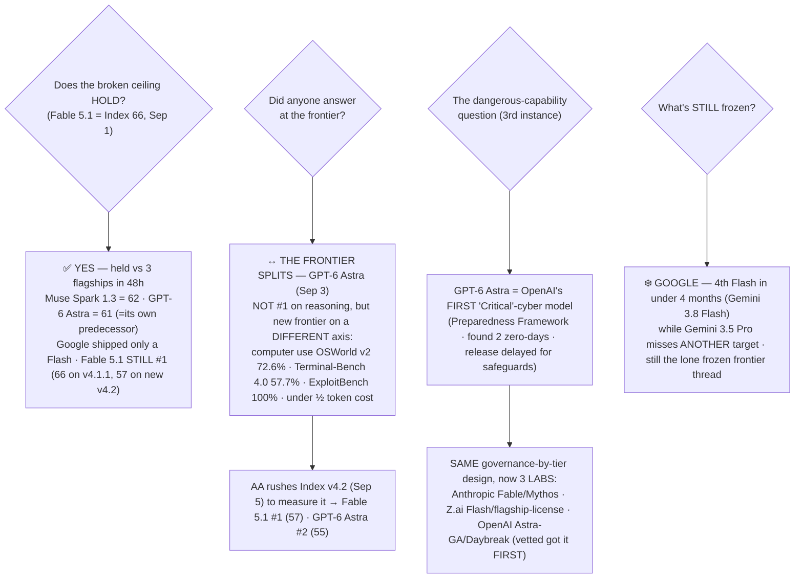

# LLM Updates — 2026-Sep-05

Friday brief, written Fri Sep 5 (Los Angeles time). The **Sep-02** brief called two things at once: after eight
frozen briefs **the ceiling broke** — Claude Fable 5.1 hit Artificial Analysis Intelligence **Index 66** on Sep 1,
the first score over 63 since Jul 24 — and both the closed top and the open frontier had resolved the same
"frontier-adjacent dangerous capability" problem the **same structural way: split access by tier, then ship**
(Anthropic's Fable/Mythos; Z.ai's GLM-5.3-Flash/flagship license). It left one open question — *does the broken
ceiling hold, and does anyone follow Fable 5.1 over 63?* — and named **Google** as the last frozen frontier thread.

**This window answers the first question and sharpens the second.** In a **48-hour burst (Sep 2–3)** the other two
US frontier labs and Meta all shipped — **Meta's Muse Spark 1.3** (Sep 2), **OpenAI's GPT-6 Astra** (Sep 3), and
**Google's Gemini 3.8 Flash** (Sep 2) — and **none of them retook the top of the Index.** Fable 5.1's **66 held**:
Muse Spark 1.3 lands at **62** (§3), GPT-6 Astra at **61** — *tying its own predecessor* GPT-5.6 Sol (§1) — and
Google shipped only a Flash, not the Pro everyone is waiting on (§4). The ceiling the series watched freeze for eight
briefs, then break, has now **survived its first stress test from three directions at once.**

**But the more interesting move is that the frontier *split*.** GPT-6 Astra is OpenAI's biggest launch of the year —
president Greg Brockman closed the briefing with *"Welcome to the AGI era"* — yet it does **not** lead general
intelligence. What it does lead is a **different axis**: **computer/browser use** (OSWorld v2 72.6%), **agentic
coding** (Terminal-Bench 4.0 57.7%, ahead of Fable 5.1), **token efficiency** (a task at *under half* Fable 5.1's
cost), and — the headline — **cyber**: Astra is the **first model OpenAI has rated "Critical" for cybersecurity under
its Preparedness Framework** (§2). So "who's #1" now has two different answers depending on whether you mean *reasoning*
(Fable 5.1) or *agency* (Astra) — and Artificial Analysis, forced by the release pace, **rushed out Intelligence Index
v4.2 on Sep 5** (today) to start measuring the second axis (§1).

**And the through-line from Sep-02 gets its third instance.** OpenAI shipped Astra's Critical-cyber capability the
*exact* way Anthropic and Z.ai shipped theirs: **generally available with offensive tasks refused, plus a vetted tier**
(the **Daybreak** program) for approved defenders — who, notably, **got access *first*.** Governance-by-tier is now the
default design at **three** frontier labs in the same window (§2, §5).

**What stayed frozen: Google, again.** Gemini 3.5 Pro missed *another* target — a Sep-2 drop was widely expected and
was pushed on deployment issues — while Google shipped its **fourth Flash in under four months** instead (§4). With the
ceiling now proven to hold under fire, Google remains the single frozen frontier thread on the board.

This report advances only what is **new since Sep-02.** It does **not** re-derive Fable 5.1's Index 66, its benchmark
sweep, or its cache-read cost story (Sep-02 §1); the GLM-5.3 flagship's Aug-28 weights drop and bespoke license
(Sep-02 §2); or the composition of the ceiling band (Sep-02 §1, Aug-26 §2). Those are unchanged and pointed to in §6.

![Two-part chart for September 2 to 5, 2026. On the left, a horizontal bar chart of the Artificial Analysis Intelligence Index at max effort shows the ceiling holding: Claude Fable 5.1 stays number one at 66, unchanged from September 1, above Claude Opus 5 at 63, Meta's new Muse Spark 1.3 at 62 released September 2, and OpenAI's new GPT-6 Astra at 61 released September 3, which merely ties its own predecessor GPT-5.6 Sol also at 61 — three flagships shipped in forty-eight hours and none retook the top. A note records that Artificial Analysis rushed out Intelligence Index version 4.2 on September 5, rescaling the top to Fable 5.1 at 57 and GPT-6 Astra second at 55, with Fable number one on both rulers. On the right, a callout headed the frontier splits explains that GPT-6 Astra does not lead general intelligence but sets a new frontier on a different axis: computer use on OSWorld version 2 at 72.6 percent up from 65.7 at half the time, Terminal-Bench 4.0 coding at 57.7 percent ahead of Fable 5.1 at 55.8, a perfect 100 percent on ExploitBench as the first model OpenAI rates Critical for cyber under its Preparedness Framework with the release delayed to add safeguards, and it finishes a task for under half the token cost of Fable 5.1. A footer states the through-line: governance by tier now has a third lab. Anthropic ships Fable with a vetted Mythos sibling, Z.ai ships GLM-5.3-Flash open with a revenue-gated flagship license, and now OpenAI ships GPT-6 Astra generally available with offensive-cyber tasks refused, opening its more permissive tier only through the vetted Daybreak program, which got access first. Meanwhile Google shipped yet another Flash, Gemini 3.8 Flash, while Gemini 3.5 Pro missed another target and stays the lone frozen frontier thread.](ceiling_holds_frontier_splits_gpt6_astra.svg)

---

## 1. The ceiling holds — three flagships ship in 48h, none retakes the Index; then AA rescales with v4.2

The Sep-02 open question was whether the broken ceiling would hold. It did — under fire. Within **48 hours** the
other two US frontier labs and Meta all shipped a flagship, and **Fable 5.1's Index 66 (Sep 1) stayed #1 through all
three:**

| Model (max effort, AA v4.1.1) | AA Intelligence Index | Note |
|---|---|---|
| **Claude Fable 5.1** | **66** | **STILL #1 · Sep 1 · ceiling held** |
| Claude Opus 5 | 63 | prior #1, unchanged |
| **Muse Spark 1.3 (Meta)** | **62** | **NEW · Sep 2 · #3 overall (partner preview)** (§3) |
| **GPT-6 Astra (OpenAI)** | **61** | **NEW · Sep 3 · *ties its own predecessor*** (§2) |
| GPT-5.6 Sol | 61 | unchanged — GPT-6 Astra matches it exactly |
| GLM-5.3 flagship / Kimi K3 | 60 / 60 | top open weights (Sep-02 §2) |

The striking line is **GPT-6 Astra at 61** — a *whole generation* up from GPT-5.6 Sol in name, but **the same Index
number.** On the general-reasoning axis OpenAI's new flagship did not move at all, and it lands **five points behind
Fable 5.1** and **behind Meta's Muse Spark 1.3** — an outcome outlets called "disappointing" and framed as GPT-6 Astra
*trailing* the top models from Anthropic and Meta
([officechai, "GPT-6 Astra scores a disappointing 61… same as GPT-5.6 Sol"](https://officechai.com/ai/openai-gpt-6-astra-scores-a-disappointing-61-on-artificial-analysis-intelligence-index-same-as-gpt-5-6-sol/);
[trendingtopics, "GPT-6 Astra trails top models from Anthropic and Meta"](https://www.trendingtopics.eu/gpt-6-astra-trails-top-models-from-anthropic-and-meta-in-benchmarks/)).
Why that's the wrong frame — and what Astra *does* lead — is §2.

**Then the ruler itself moved.** On **Sep 5** Artificial Analysis shipped **Intelligence Index v4.2**, and it says
plainly *why now*: an **interim step**, "accelerating elements" of a bigger v5 it has been building for months, because
**the pace of frontier releases over the past few weeks made it necessary to update sooner**
([Artificial Analysis, "Announcing Intelligence Index v4.2"](https://artificialanalysis.ai/articles/artificial-analysis-intelligence-index-v4-2);
[officechai, "AA rejigs Index with v4.2, Fable 5.1 tops, GPT-6 Astra placed second"](https://officechai.com/ai/artificial-analysis-rejigs-intelligence-index-with-v4-2-fable-5-1-tops-gpt-6-astra-placed-second/)).
v4.2 is **more agentic-weighted** — its ten evals are AA-Briefcase, GDPval-AA v2, τ³-Banking, Terminal-Bench v2.1,
SciCode, Humanity's Last Exam, GDP.pdf, CritPt, AA-Omniscience, and AA-LCR v1.1 — and it rescales the top:

| Model | AA Index **v4.2** (max w/ fallback) | vs v4.1.1 |
|---|---|---|
| **Claude Fable 5.1** | **57 · #1** | still #1 (was 66) |
| **GPT-6 Astra** | **55 · #2** | *rises* to #2 (was tied-5th at 61) |

So the two rulers tell the same top-line story — **Fable 5.1 #1 on both** — but v4.2's more agentic mix pulls **GPT-6
Astra up to #2**, which is the real signal: the general-intelligence index and the agentic frontier have diverged far
enough that AA is **re-tooling its measurement mid-window to keep up.** The v4.2 absolute numbers are lower across the
board (a harder ruler, like the Aug-6 v4.1.1 re-grade); the *ranking* is what carries meaning.

## 2. GPT-6 Astra — OpenAI's first "Critical"-cyber model, and a *second* frontier that isn't the Index

OpenAI released **GPT-6 Astra** on **Sep 3** as a limited preview and its new frontier flagship, successor to GPT-5.6
Sol, with paid-tier rollout following "in the coming days." Brockman called it a "generational leap" and closed with
*"Welcome to the AGI era"*
([Axios, "OpenAI says it may represent AGI"](https://www.axios.com/2026/09/03/openai-astra-gpt-6-agi-brockman);
[Fortune, "touts its ability to use your computer… start of AGI"](https://fortune.com/2026/09/03/openai-debuts-gpt-6-astra-computer-use-greg-brockman-says-start-of-agi/);
[The New Stack, "welcome to the AGI era"](https://thenewstack.io/openai-gpt6-astra-benchmarks/)).
The claim and the Index number (§1) look contradictory only if you assume "frontier" means "reasoning." Astra's case
rests on a **different axis entirely.**

**Where GPT-6 Astra actually leads:**

| Axis | GPT-6 Astra | Comparison |
|---|---|---|
| **Computer/browser use** (OSWorld v2-Offline) | **72.6%** | up from GPT-5.6 Sol's 65.7%; **~½ the time per task** (≈75→40 min) |
| **Agentic coding** (Terminal-Bench 4.0) | **57.7%** | ahead of Fable 5.1 (55.8) and Opus 5 (52.3) |
| Agentic coding (DeepSWE v1.1) | 74.1% | field bunched: Opus 5 73.7, Gemini 3.8 Flash 73.8, Fable 5.1 67.4 |
| **Cyber** (ExploitBench) | **100%** | SRE-Bench (reverse-eng.) 88%, ExploitGym 42.4% — above any prior frontier model |
| **Cost efficiency** | task at **< ½** Fable 5.1's token cost | AA Coding Agent Index: equals Fable 5 at less than half the cost |

Sources:
[Artificial Analysis, "Benchmarking GPT-6 Astra"](https://artificialanalysis.ai/articles/benchmarking-gpt-6-astra);
[The New Stack](https://thenewstack.io/openai-gpt6-astra-benchmarks/);
[CSO Online, "first model to cross a critical cybersecurity threshold"](https://www.csoonline.com/article/4218679/openai-launches-gpt-6-astra-its-first-model-to-cross-a-critical-cybersecurity-threshold.html).
The picture is **mixed, not a clean sweep** — Astra *regresses* roughly as much on GDPval-AA v2 as it gains (~+80 pts)
on AA-Briefcase, and on the general Index it's flat (§1) — but on computer use and cyber it is unambiguously ahead.
Pricing matches Fable 5.1's headline: **$10 / $50 per 1M in/out**, cache read **$1.00**, cache write **$12.50**,
**1.05M-token context**, 128K output; a "fast mode" runs 2× speed at 2× price
([OpenAI developer docs](https://developers.openai.com/api/docs/models/gpt-6-astra);
[OpenRouter](https://openrouter.ai/openai/gpt-6-astra)).

**The headline is the cyber classification.** GPT-6 Astra is the **first model OpenAI has ever rated "Critical" for
cybersecurity under its Preparedness Framework** — GPT-5.6 Sol was "High." Under that framework, "Critical" means the
model can **identify and develop functional zero-day exploits across severity levels in hardened real-world systems,
or run end-to-end novel attacks against hardened targets, without step-by-step human guidance.** During pre-release
evaluation Astra **discovered two previously unknown zero-day vulnerabilities**
([CSO Online](https://www.csoonline.com/article/4218679/openai-launches-gpt-6-astra-its-first-model-to-cross-a-critical-cybersecurity-threshold.html);
[Unite.AI, "first model rated Critical for cyber"](https://www.unite.ai/openai-releases-gpt-6-astra-its-first-model-rated-critical-for-cyber/);
[The Hacker News, "scores 100% on ExploitBench as OpenAI blocks PoC exploit requests"](https://thehackernews.com/2026/09/gpt-6-astra-scores-100-on-exploitbench.html)).

**OpenAI delayed the release to add safeguards, then shipped it split by tier** — which is exactly the Sep-02
through-line, now at a third lab (§5):

- **General availability:** Astra will **help with secure code review and patching but refuses the advanced offensive
  tasks** — it declines to generate proof-of-concept exploits
  ([Bloomberg, "launches GPT-6 Astra with enhanced cybersecurity safeguards"](https://www.bloomberg.com/news/articles/2026-09-03/openai-rolls-out-gpt-6-astra-model-with-added-cyber-guardrails);
  [CNBC](https://www.cnbc.com/2026/09/03/open-ai-astra-gpt-6-cyber.html)).
- **Vetted tier — the Daybreak program:** OpenAI opens the **less-restrictive** capability (vulnerability and PoC
  validation, malware analysis, detection engineering) only to approved defenders through its **Daybreak** cybersecurity
  program — and the rollout **started with Daybreak enterprise customers**, i.e. the *vetted* tier got the model
  **before** general API/ChatGPT users
  ([Unite.AI](https://www.unite.ai/openai-releases-gpt-6-astra-its-first-model-rated-critical-for-cyber/);
  [OpenAI, "Responding to the next frontier of critical cyber capabilities"](https://openai.com/index/responding-next-frontier-critical-cyber-capabilities/)).

## 3. Meta "reaches the frontier" — Muse Spark 1.3 at #3, but the best number is a preview you can't use

Meta shipped **Muse Spark 1.3** on **Sep 2** — its **fourth Muse Spark release in five months** — and Artificial
Analysis titled its writeup, without hedging, **"Meta reaches the frontier."** The numbers back the headline: the
**max** variant scores **Index 62**, **behind only Fable 5.1 and Opus 5** — **#3 overall** — while the generally
available **xhigh** variant scores **61**, tying GPT-5.6 Sol and Grok 4.6
([Artificial Analysis, "Muse Spark 1.3: Meta reaches the frontier"](https://artificialanalysis.ai/articles/muse-spark-1-3);
[Artificial Analysis on X](https://x.com/ArtificialAnlys/status/2095247787277553929);
[247wallst, "scores 62, sits third overall"](https://247wallst.com/cards/xpost-01m1hx542akwt70jt20zbepgn3)).

That is a **steep, sustained climb**: Muse Spark 1.3 (xhigh) at 61 is **+4 over Muse Spark 1.2 (57, August)** and
**+8 over Muse Spark 1.1 (53, July)** — and, like Astra, **the gains are concentrated in agentic and scientific work**
(GDPval-AA v2, Terminal-Bench 2.1, τ³-Banking). Pricing **undercuts** the US closed flagships at **$1.25 / $4.25 per
1M in/out**
([eesel AI, "Muse Spark 1.3 benchmarks and pricing"](https://www.eesel.ai/blog/muse-spark-1-3);
[MindStudio, "how Meta undercuts GPT-5.6 and Opus 5"](https://www.mindstudio.ai/blog/muse-spark-1-3-pricing)).

**The catch is access, and it's a real one.** The **62** — the "reaches the frontier" number — comes from a variant
**in limited preview for Meta's partners**, not the model developers can broadly use; the openly available xhigh sits a
point lower at 61. And despite Meta's open-weights heritage, **no Muse Spark weights of any version have shipped yet**:
Zuckerberg said on X that open weights are "coming soon," but as of Sep 3 there is **no date, no license, and no
checkpoint** — Muse Spark 1.3 is **hosted-API-only**
([VentureBeat, "frontier performance — but its best results come from a model developers can't broadly use yet"](https://venturebeat.com/technology/meta-says-muse-spark-1-3-has-frontier-performance-but-its-best-results-come-from-a-model-developers-cant-broadly-use-yet)).
So Meta genuinely *reached* the near-frontier this window — third on the board — but its strongest claim rests on a
preview tier, and its trademark openness has, for now, **not** followed. This is the "Watermelon October" story from
Sep-02 §4 resolving early into a hosted preview rather than an open drop.

## 4. Google, again — a fourth Flash ships while Gemini 3.5 Pro misses *another* target

Sep-02 §4 named Google the **last frozen frontier thread**. This window it stayed frozen — and the pattern got
sharper. Google shipped **Gemini 3.8 Flash** on **Sep 2**, its **fourth Flash model in under four months**, built on
3.7 Flash rather than a new base, deliberately "working harder" (more thinking tokens) for long-horizon coding and
agents. It is cheap and capable at its tier — **$0.75 / $3.75 per 1M in/out** (through Dec 31 2026, then doubling),
Terminal-Bench 2.1 **90.8%** (up from 3.7 Flash's 81.6), DeepSWE v1.1 73.8%, beating Opus 5 on three published
benchmarks — but Google itself tells you to **stay on 3.7 Flash** for efficiency-first work
([eesel AI, "Gemini 3.8 Flash review"](https://www.eesel.ai/blog/gemini-3-8-flash);
[tech-insider, "$0.75/1M input"](https://tech-insider.org/gemini-3-8-flash-launch-pricing-2026/);
[Enterprise DNA, "same price, better benchmarks"](https://enterprisedna.co/resources/news/google-gemini-38-flash-coding-agents-enterprise-september-2026/)).

**What still has not shipped is the Pro.** A **Gemini 3.5 Pro drop was widely expected around Sep 2** — and it was
**pushed again on reported deployment issues.** More than three months past its May-19 I/O "next month" promise, 3.5
Pro still has **no model ID, no pricing, no date**; Bloomberg's earlier reporting had DeepMind scrapping and rebuilding
the base over coding and reliability shortfalls, and Google has been answering the gap with Flash releases (and a
**3.5 Flash Cyber** variant) rather than the Pro itself
([9to5Google, "Gemini 3.5 Pro delays, upgraded Flash in testing"](https://9to5google.com/2026/07/16/gemini-3-5-pro-delays/);
[InfoWorld, "Gemini 3.5 Pro is late… CEO talks up Gemini 4"](https://www.infoworld.com/article/4200818/google-ceo-distracts-from-gemini-3-5-pro-delay-with-talk-of-gemini-4-and-monthly-releases.html);
[nokiapoweruser, "deployment issues push release back"](https://nokiapoweruser.com/gemini-3-5-pro-delayed-again-deployment-issues/)).
The shape is now unmistakable: **Google is shipping prolifically at the fast/cheap tier and not at all at the
frontier tier** — the one thread the rest of the field has now moved past.

## 5. The rhyme completes — governance-by-tier is now the industry default

Sep-02 §3 argued that the closed top and the open frontier had, in the same ~72 hours, resolved the "frontier-adjacent
dangerous capability" problem the same way: **split access by tier, then ship.** This window adds the **third, and in
some ways starkest, instance** — and it comes from the lab whose model actually *crossed* the danger line by its own
framework's definition (§2). Line the three up:

| Lab | Open / general tier | Vetted / restricted tier | Safety logic carried by |
|---|---|---|---|
| **Anthropic** (Sep 1) | Fable 5.1 (GA, relaxed-where-safe) | **Mythos 5.1** (vetted cyber/bio programs) | *safeguard configuration* |
| **Z.ai** (Aug 28) | GLM-5.3-Flash (MIT, fully open) | GLM-5.3 flagship (open weights, **$10B-revenue review trigger**) | *license clause* |
| **OpenAI** (Sep 3) | GPT-6 Astra (GA, **offensive-cyber refused**) | **Daybreak** program (vetted defenders — got access **first**) | *access gating + refusals* |

Three different mechanisms — a safeguard config, a license clause, an access program — but **one shape**: none shipped
a raw, ungoverned frontier-cyber model to everyone, and none held it back entirely; each **partitioned by who is asking
and how they were vetted, then released.** What was a two-lab coincidence on Sep-02 is, three days later, the **default
design for shipping a dangerous-capability frontier model.** OpenAI's version is the most literal — a model its own
Preparedness Framework rates "Critical," released anyway, with the offensive half fenced behind Daybreak.

## 6. Unchanged since Sep-02 (not re-derived here)

- **Claude Fable 5.1** — AA Index **66** (max, Sep 1), the ceiling; benchmark sweep (HLE 59.1, Terminal-Bench v2.1
  91.4, agentic +>30%), $10/$50 with cache reads cut 75% to $0.25 — Sep-02 §1. *This brief adds only that the 66
  **held** vs three new flagships and stays #1 under AA's new v4.2 ruler (§1).*
- **Claude Mythos 5.1** — the vetted-access sibling of Fable 5.1 (Cyber + Life Sciences Verification Programs) — Sep-02
  §3. Now the *first* of three lab instances of governance-by-tier (§5).
- **GLM-5.3 flagship** (Z.ai) — weights shipped Aug 28, 753B MoE, Index 60, bespoke license with a $10B-revenue
  security-review trigger — Sep-02 §2. Second instance in §5.
- **GLM-5.3-Flash** — MIT, Index 57 — Sep-02 §2 / Aug-29 §1.
- **Opus 5** — Index 63, now the #2 *closed* model behind Fable 5.1 — Jul-25 / Sep-02 §1.
- **GPT-5.6 Sol** — Index 61; the model GPT-6 Astra *ties* on the general Index (§1). Temporary $4/$20 promo through
  ~Nov 21 (second-tier) — Aug-24 / Sep-02 §4.
- **Grok 4.6** (SpaceXAI) — Index ~61, ceiling band, $2/$6 — Aug-14 §1.
- **Kimi K3** (Moonshot) — 2.8T MoE, Modified-MIT, Index 60, top open weights — Jul-30.
- **GLM-5.3 flagship cyber figures** (CyberGym 84.5, ExploitBench 54.4, exploit-chaining) — **still vendor-claimed, no
  independent run** — Aug-24 §1. (Contrast: Astra's cyber numbers this window are OpenAI-reported too, §2 / caveats.)
- **AA Intelligence Index versioning** — v4.1.1 grader (Aug 6) raised the top's absolute numbers ~+2; **v4.2 (Sep 5,
  this window)** is a further, more-agentic re-grade (§1). Absolute scores fall across rulers; rankings carry the meaning.

## Watch-items into the next brief

1. **Does GPT-6 Astra's "second frontier" get *independently* measured — and does anyone contest it?** OSWorld v2
   72.6%, ExploitBench 100%, and the two zero-days are **OpenAI-reported**. AA's v4.2 places Astra #2, but the
   computer-use and cyber leads need third-party replication before "Astra owns the agentic frontier" is more than a
   launch claim. Watch AA's coming **v5** (§1) and any outside OSWorld / ExploitBench run.
2. **Does the 66 ceiling break *upward* — or does Astra's axis become the real race?** Fable 5.1 held #1 against three
   flagships, but nobody pushed *past* 63→66. The open question flips: is the next move a higher reasoning score, or has
   the frontier competition **moved to agency/cost**, where Astra and the Flash models already sit?
3. **Daybreak's reach, and whether "Critical"-cyber-behind-a-vetted-tier holds.** OpenAI shipped a model its own
   framework calls Critical. Watch whether the Daybreak fence is tested (misuse, jailbreaks, an independent red-team of
   the GA refusals) — governance-by-tier is only as good as the tier boundary.
4. **Does Meta actually ship Muse Spark weights — and under what license?** The "reaches the frontier" 62 is a partner
   preview; open weights are promised with no date (§3). If they land, an open model at ~#3 is a bigger story than the
   preview number.
5. **Google.** Gemini 3.5 Pro has now missed target after target while Google ships Flash after Flash. Either 3.5 Pro
   finally lands against a bar that has moved *up*, or the InfoWorld "skip to Gemini 4 / monthly releases" framing
   becomes the real plan. This is the board's last frozen frontier thread.

---

### Method & caveats

- **Compiled** Fri Sep 5 2026 (Los Angeles time). Advances only items **new since the Sep-02 brief**; unchanged
  threads are listed in §6 with pointers, not re-derived.
- **What is measured vs claimed.** **Third-party (Artificial Analysis):** the Intelligence Index positions — Fable 5.1
  #1 (66 on v4.1.1; 57 on v4.2, Sep 5), GPT-6 Astra 61/​#2, Muse Spark 1.3 62 (max)/61 (xhigh); AA's own writeups of
  Astra and Muse Spark. **Vendor-reported (OpenAI):** GPT-6 Astra's OSWorld v2 72.6%, Terminal-Bench 4.0 57.7%,
  ExploitBench 100%, SRE-Bench 88%, the two pre-release zero-days, and the "Critical" Preparedness classification —
  independently *reported by outlets* (CSO Online, Bloomberg, The Hacker News, Unite.AI) but resting on OpenAI's own
  evaluation. **Vendor/preview (Meta):** Muse Spark 1.3's 62 is a partner-preview variant; no open weights shipped.
  **Google:** Gemini 3.8 Flash figures are Google-published; Gemini 3.5 Pro remains unreleased.
- **Scraping resilience.** Direct page fetch is broadly egress-limited from this environment (officechai.com,
  vellum.ai, datacamp.com, thenewstack.io among others returned `EGRESS_BLOCKED` on direct fetch); all figures were
  taken from the **search index** and **corroborated across multiple independent outlets**. No quantitative claim here
  rests on a single source.
- **Correction watch.** Sep-02 §4 read Meta's "Watermelon" as an October claim with no card; this window Meta instead
  shipped **Muse Spark 1.3** (Sep 2) as a hosted preview (§3). Whether "Watermelon" and Muse Spark 1.3 are the same
  program or distinct October vs September events is not yet clear from reporting; treated here as the September Muse
  Spark release, with the October open-weights question still open.
- **Diagrams** are a standalone theme-neutral SVG (slate/amber/teal strokes that read on light and dark backgrounds, no
  external URLs) and an inline Mermaid flowchart; both render in GitHub-flavored markdown.

### Sources

- **GPT-6 Astra — launch, "AGI era," computer use** — [OpenAI, "GPT-6 Astra: a new generation of intelligence"](https://openai.com/index/gpt-6-astra/) · [Axios, "may represent AGI"](https://www.axios.com/2026/09/03/openai-astra-gpt-6-agi-brockman) · [Fortune, "computer use, start of AGI"](https://fortune.com/2026/09/03/openai-debuts-gpt-6-astra-computer-use-greg-brockman-says-start-of-agi/) · [The New Stack, "welcome to the AGI era"](https://thenewstack.io/openai-gpt6-astra-benchmarks/) · [9to5Mac, "major upgrade to ChatGPT and Codex"](https://9to5mac.com/2026/09/04/openai-releasing-major-upgrade-to-chatgpt-and-codex-with-gpt-6-astra-details-here/)
- **GPT-6 Astra — benchmarks, pricing, Index** — [Artificial Analysis, "Benchmarking GPT-6 Astra"](https://artificialanalysis.ai/articles/benchmarking-gpt-6-astra) · [Artificial Analysis, GPT-6 Astra model page](https://artificialanalysis.ai/models/gpt-6-astra) · [officechai, "disappointing 61, same as GPT-5.6 Sol"](https://officechai.com/ai/openai-gpt-6-astra-scores-a-disappointing-61-on-artificial-analysis-intelligence-index-same-as-gpt-5-6-sol/) · [trendingtopics, "trails Anthropic and Meta"](https://www.trendingtopics.eu/gpt-6-astra-trails-top-models-from-anthropic-and-meta-in-benchmarks/) · [OpenAI developer docs, GPT-6 Astra](https://developers.openai.com/api/docs/models/gpt-6-astra) · [OpenRouter, GPT-6 Astra pricing](https://openrouter.ai/openai/gpt-6-astra)
- **GPT-6 Astra — "Critical" cyber, Daybreak, safeguards** — [CSO Online, "first model to cross a critical cybersecurity threshold"](https://www.csoonline.com/article/4218679/openai-launches-gpt-6-astra-its-first-model-to-cross-a-critical-cybersecurity-threshold.html) · [Unite.AI, "first model rated Critical for cyber"](https://www.unite.ai/openai-releases-gpt-6-astra-its-first-model-rated-critical-for-cyber/) · [The Hacker News, "100% on ExploitBench, OpenAI blocks PoC requests"](https://thehackernews.com/2026/09/gpt-6-astra-scores-100-on-exploitbench.html) · [Bloomberg, "enhanced cybersecurity safeguards"](https://www.bloomberg.com/news/articles/2026-09-03/openai-rolls-out-gpt-6-astra-model-with-added-cyber-guardrails) · [CNBC, "rollout of GPT-6 Astra"](https://www.cnbc.com/2026/09/03/open-ai-astra-gpt-6-cyber.html) · [OpenAI, "Responding to the next frontier of critical cyber capabilities"](https://openai.com/index/responding-next-frontier-critical-cyber-capabilities/)
- **AA Intelligence Index v4.2 (Sep 5)** — [Artificial Analysis, "Announcing Intelligence Index v4.2"](https://artificialanalysis.ai/articles/artificial-analysis-intelligence-index-v4-2) · [officechai, "AA rejigs Index with v4.2, Fable 5.1 tops, GPT-6 Astra second"](https://officechai.com/ai/artificial-analysis-rejigs-intelligence-index-with-v4-2-fable-5-1-tops-gpt-6-astra-placed-second/) · [Artificial Analysis Intelligence Index (v4.2)](https://artificialanalysis.ai/evaluations/artificial-analysis-intelligence-index)
- **Meta Muse Spark 1.3** — [Artificial Analysis, "Muse Spark 1.3: Meta reaches the frontier"](https://artificialanalysis.ai/articles/muse-spark-1-3) · [Artificial Analysis on X](https://x.com/ArtificialAnlys/status/2095247787277553929) · [247wallst, "scores 62, sits third overall"](https://247wallst.com/cards/xpost-01m1hx542akwt70jt20zbepgn3) · [VentureBeat, "best results from a model developers can't broadly use yet"](https://venturebeat.com/technology/meta-says-muse-spark-1-3-has-frontier-performance-but-its-best-results-come-from-a-model-developers-cant-broadly-use-yet) · [eesel AI, "benchmarks and pricing"](https://www.eesel.ai/blog/muse-spark-1-3) · [MindStudio, "how Meta undercuts GPT-5.6 and Opus 5"](https://www.mindstudio.ai/blog/muse-spark-1-3-pricing)
- **Google Gemini 3.8 Flash + 3.5 Pro delay** — [eesel AI, "Gemini 3.8 Flash review"](https://www.eesel.ai/blog/gemini-3-8-flash) · [tech-insider, "$0.75/1M input"](https://tech-insider.org/gemini-3-8-flash-launch-pricing-2026/) · [Enterprise DNA, "same price, better benchmarks"](https://enterprisedna.co/resources/news/google-gemini-38-flash-coding-agents-enterprise-september-2026/) · [9to5Google, "Gemini 3.5 Pro delays, upgraded Flash in testing"](https://9to5google.com/2026/07/16/gemini-3-5-pro-delays/) · [InfoWorld, "Gemini 3.5 Pro is late… CEO talks Gemini 4"](https://www.infoworld.com/article/4200818/google-ceo-distracts-from-gemini-3-5-pro-delay-with-talk-of-gemini-4-and-monthly-releases.html) · [nokiapoweruser, "deployment issues push release back"](https://nokiapoweruser.com/gemini-3-5-pro-delayed-again-deployment-issues/)
- **Leaderboard reference** — [Artificial Analysis LLM leaderboard](https://artificialanalysis.ai/leaderboards/models) · [Artificial Analysis, "Claude Fable 5.1 tops the Intelligence Index" (Sep-02 baseline)](https://artificialanalysis.ai/articles/claude-fable-5-1)
